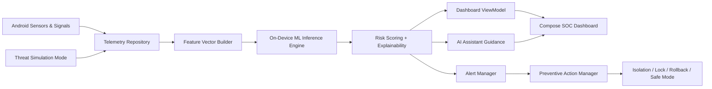

# Architecture Diagram

```mermaid
flowchart LR
    A[Android Sensors & Signals] --> B[Telemetry Repository]
    B --> C[Feature Vector Builder]
    C --> D[On-Device ML Inference Engine]
    D --> E[Risk Scoring + Explainability]
    E --> F[Alert Manager]
    E --> G[Dashboard ViewModel]
    G --> H[Compose SOC Dashboard]
    F --> I[Preventive Action Manager]
    I --> J[Isolation / Lock / Rollback / Safe Mode]
    E --> K[AI Assistant Guidance]
    K --> H
    L[Threat Simulation Mode] --> B
```
